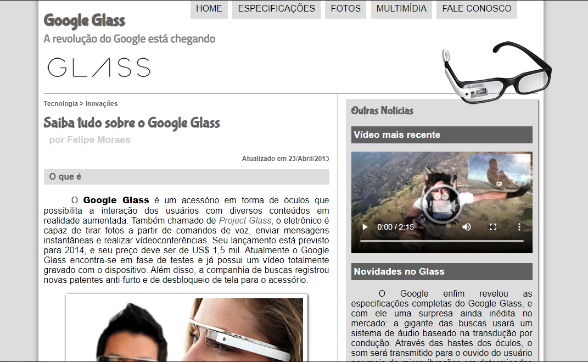

<h1 align="center">
  Projeto Google Glass
</h1>

## 📋 Índice

- [Preview](#-Preview)
- [Sobre](#-Sobre)
- [Tecnologias utilizadas](#-Tecnologias-utilizadas)
- [Como executar o projeto](#-Como-executar-o-projeto)

---

## 🖥 Preview

  

---

## 📖 Sobre 

Este site foi desenvolvido durante o curso de HTML5 e CSS3 do Curso em Video com o professor Gustavo Guanabara, durante o curso foram ensinadas as principais tags e as mudanças que ocorreram na semantica do HTML5, ao final do projeto ocorreu uma avaliação para testar os conhecimentos adquiridos no decorrer do projeto.

---

## 🚀 Tecnologias utilizadas
O projeto está sendo desenvolvido com as seguintes tecnologias:
- HTML
- CSS
- JavaScript

---

## ⌨ Como executar o projeto

Baixe o arquivo .ZIP do projeto e após descompactar abra o arquivo index.html

---
